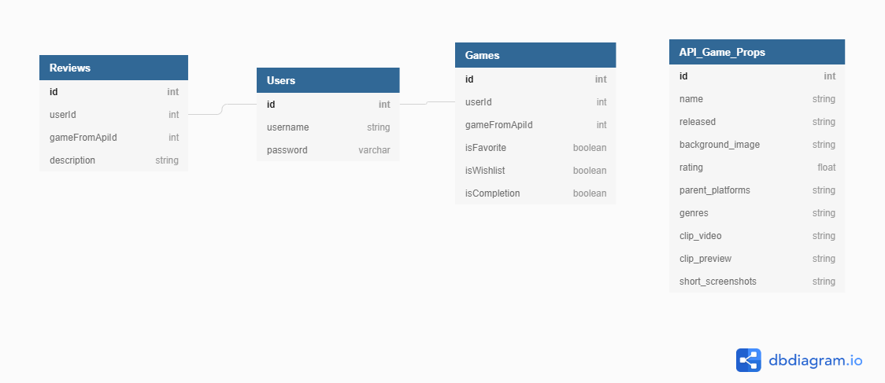

A front-end capstone project from [Brian Cravens](https://github.com/BrianCravens) for [Nashville Software School C40](https://github.com/nss-day-cohort-40).

## Brief Proposal

Video game enthusiasts that want to be able to keep track of the video games that they have completed, which of those are their favorites, and keep track of the ones they have yet to play.  Game Track is an App that allows you to do just that with the power of the RAWG API.  You can search through thousands of games and create your lists as well as keeping them updated.  

## Project Definition

* Written in React.
* Users can create account, login , and logout
* Ability to create, read, update, delete “Completed Games List, Wish List, and Favorites List,”
* Ability to create, read, update, delete “User Specific Reviews”

## Setup

Steps to get started:
1. `git clone git@github.com:BrianCravens/GameTrack.git`
1. `cd` into the directory it creates
1. `mkdir api`
1. `touch api/`
1. Download one of the database files:
    1. [EMPTY: database.json](https://docs.google.com/document/d/1SH22dRl5K3aSCrFXyuMVH7uxV0swRcte8RZzOfJVkB0/edit?usp=sharing) 
1. Move your database.json file into the /api/ directory.
1. `npm install` to build dependencies
1. `npm start` to run the app in the development mode
1. `json-server -p 5002 -w api/database.json`
1. Open [http://localhost:3000](http://localhost:3000) to view it in the browser.

## Overview

This app is a personal Game Tracker for video game enthusiasts. When a user logs in, they will then have the options of creating their different lists.  From the starting page you can sort games by genre or use the search field.  After clicking on a game, you then have the options to select the game to be on a certain list, Completions, Favorites, or Wish List.  There is also the ability in the Game Details for logged in users to write reviews on games.  

## Technologies Used

This project utilizes the following:
* This project was created with [Create React App](https://github.com/facebook/create-react-app).
* [React Router](https://reacttraining.com/react-router/) for page routing
* [React-bootstrap](https://react-bootstrap.github.io/) for menu, flexible formatting
* [RAWG API](https://rawg.io/apidocs) for Video Game data

## Skills Utilized

We utilized all skills and concepts learned up to this point in our time here at NSS, including:

1. React: hooks, state, props, routes
1. API calls with: POST, PUT, PATCH, DELETE, and GET (with expand, embed)
1. Javascript: functions, objects, arrays, mapping
1. Persistent data storage with JSON Server
1. Github Scrum workflow
1. CSS styling

## Database Diagram
